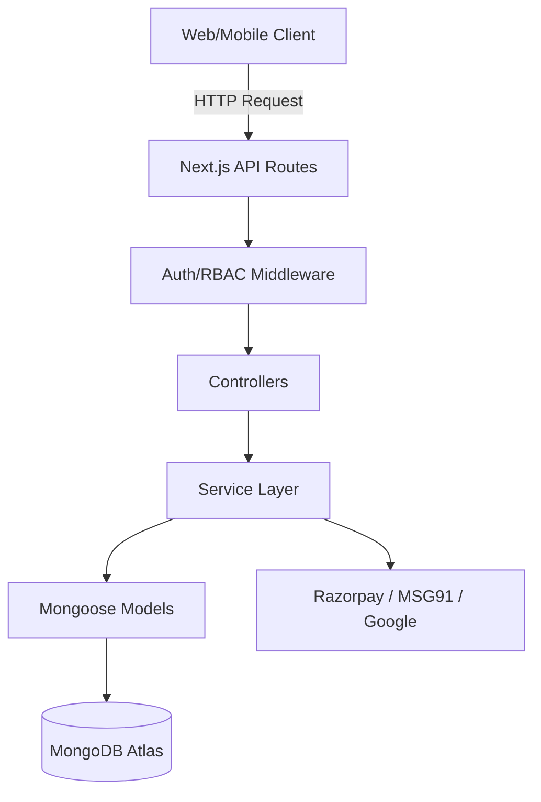

# Architecture & Design

PahadiGo follows a modern, **Service-Oriented Architecture (SOA)** designed for high scalability and clear separation of concerns within a Next.js environment.

---

## Architectural Layers

### 1. Delivery Layer (`src/app/`)

The entry point for all interactions:

- **UI Components**: React components rendering the platform's public and protected views.
- **API Route Handlers**: Next.js App Router endpoints that receive HTTP requests and delegate to the **Controller Layer**.
- **Middleware**: Intercepts requests for Authentication (JWT) and Role-Based Access Control (RBAC).

### 2. Controller Layer (`src/core/Http/Controllers/`)

Thin orchestration handlers that focus on:

- Parsing and validating incoming request data.
- Invoking the appropriate **Service Layer** methods.
- Executing standard response formatting using `ResponseHelper`.

### 3. Service Layer (`src/core/Services/`)

The core business logic engine, decoupled from HTTP contexts:

- **Independent Services**: Logic for Auth, Booking, Razorpay, etc., resides here.
- **Workflow Orchestration**: Managing complex operations across multiple models.
- **Third-Party Integration**: Communication with external APIs (MSG91, Google Auth).

### 4. Data Layer (`src/core/Models/`)

Mongoose schemas and models defining the persistence layer:

- **Rich Schemas**: 17+ models including `Package`, `Vendor`, `AuditLog`, and `User`.
- **Hooks & Validation**: Built-in Mongoose middleware for data integrity.

---

## Data Flow

---

## Technical Strategies

### Security

- **JWT-Based Stateless Auth**: No server-side session state; tokens carry role and identity.
- **Audit Logging**: Every administrative action is captured in the `AuditLog` for transparency.
- **Credential Protection**: Strict environment variable isolation using `.env`.

### Performance

- **Connection Caching**: MongoDB connections are reused across serverless executions to prevent exhaustion.
- **Modular Services**: Services can be tested and scaled independently.

### Testing

- **Tiered Approach**:
  - **Unit Tests**: Logic testing for individual Services.
  - **Integration Tests**: Verification of Controller-to-Model flows using `Supertest` and `mongodb-memory-server`.
