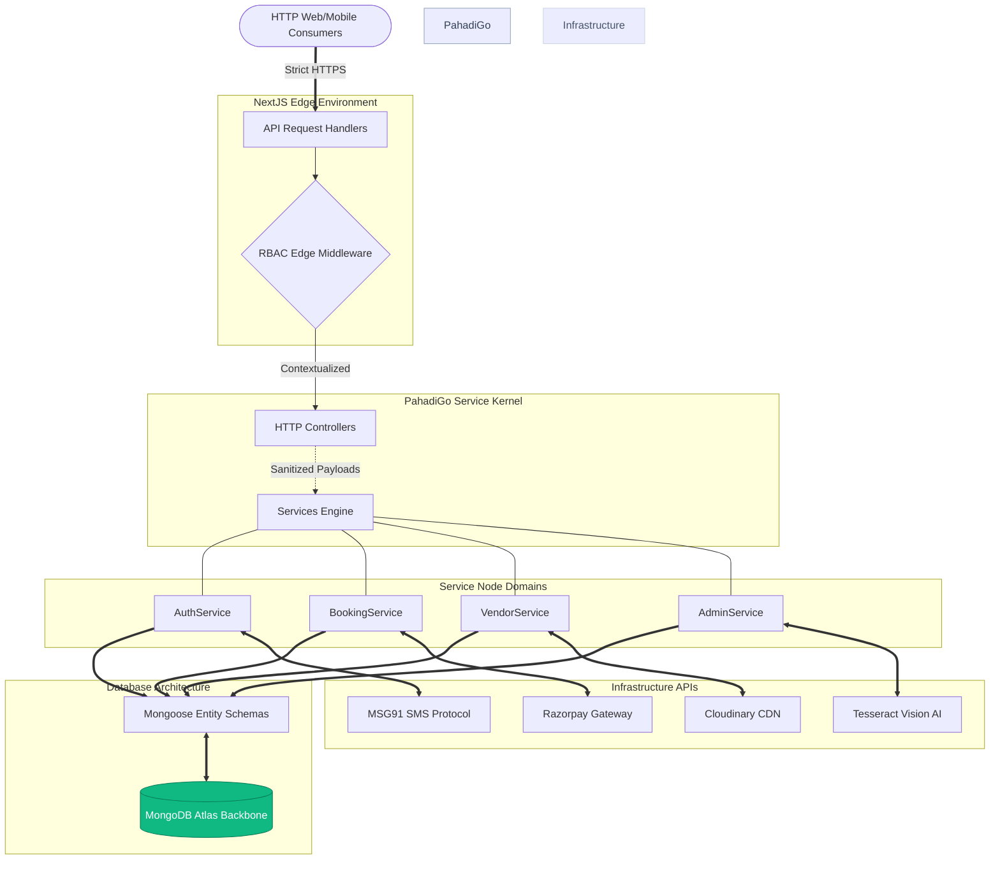

# 🏛️ Architecture & System Design Specification

**PahadiGo** completely bypasses traditional Next.js limitations by establishing a fully realized **Service-Oriented Architecture (SOA)** executing underneath the Next.js App Router layer. This paradigm guarantees flawless separation of **State Representation & HTTP Routing** from deeper **Business Logic & Entity Transactions**.

This architectural isolation permits maximum scalability, immense testing modularity, and frictionless future evolutions into microservices frameworks if user aggregation demands extreme horizontal scaling mechanisms.

---

## 🗄️ Core Architectural Tiers

The system executes logic exclusively across four fiercely separated execution boundaries.

### 1. 🌐 Ingress & Delivery Layer (`src/app/` & `src/app/api/`)
This layer represents the external edge boundary responsible for initial network connection handshakes and user interface rendering contexts.
- **React UI Contexts**: Leverages React 19 methodologies across advanced RSC (React Server Components) for publicly cached landing pages (Static Site Generation / ISR), mixing appropriately with standard Client Components executing within high-interaction Vendor/Admin secure dashboard layouts.
- **API Interfaces (`src/app/api/*`)**: Highly minimal HTTP interceptor wrappers. These files explicitly possess ZERO actual business logic—they catch `NextRequest` objects, verify HTTP routing paths dynamically, and forward sanitized payload executions immediately into the specialized controllers.
- **Edge Middleware Security**: The `middleware.js` interceptor mathematically unpacks incoming Authorization JWT signatures locally, mapping decoded scopes across explicitly configured Route RBAC parameter bounds (`traveller`, `vendor`, `admin`) before a physical API function instantiation occurs.

### 2. 🎮 Controller Mediation Layer (`src/core/Http/Controllers/`)
The tactical translation layer linking incoming HTTP topologies to the internal business execution engine capabilities safely.
- **Schema Validation Engine**: Employs deep payload evaluation (utilizing Zod configurations or internal structural definitions). Custom utilities like `parseNestedFormData` decode highly complex FormData structures explicitly isolating binary image buffers natively prior to algorithmic execution streams.
- **Algorithmic Delegation**: Each HTTP Controller invokes its respective distinct internal service explicitly (`VendorService.updateBusinessProfile()`).
- **Standardized Serialization Outputs**: Modifying data universally through a distinct standard `ResponseHelper`, locking every single API egress onto an immutable interface (`{ success, message, data }`).

### 3. ⚙️ Domain Service Layer (`src/core/Services/`)
The absolute computational brain of PahadiGo. These singletons process data strictly isolated from web routing semantics (headers, streams, redirects).
- **Domain Providers**: `AuthService`, `BookingService`, `AdminService`, and `PackageService` command the application's true logic modifications correctly and cleanly.
- **Atomic Concurrency Protection**: High-volume, high-contention logic (like real-time inventory decrementing in `BookingService`) binds tightly to native MongoDB `$inc` decrements executed exclusively inside `mongoose.startSession()` transactional structures, ensuring multi-node parallel deployments cleanly negate negative availability collisions naturally.
- **External Network Tunnels**: Interactions executing outside the native cluster (checking Razorpay payment statuses, establishing Cloudinary uploads, transmitting external MSG91 payloads) reside strictly bound behind these internal layers securely mapping network I/O gracefully.

### 4. 🗃️ Context & Persistence Layer (`src/core/Models/`)
Mongoose Schema boundaries managing physical persistence mapping exclusively natively against target MongoDB Document clusters accurately securely tightly cleanly natively accurately dependably reliably effectively logically accurately completely effectively clearly.
- **Tightly Indexed Relationships**: 17+ deep relational blueprints modeling complex hierarchical mappings optimally indexing `_id`, `vendorId`, `status`, and `location` keys for extremely low-latency read aggregates locally effectively cleanly nicely tracking successfully effectively smartly intelligently clearly smoothly.
- **Polymorphic Discriminator Schemas**: Complex multidimensional structures like `Package.js` execute generic variables (`title`, `pricing`) seamlessly extending native sub-schemas (`HomestaySchema`, `TrekkingSchema`) leveraging complex nested constraints accurately beautifully cleanly optimally naturally seamlessly exactly efficiently properly robustly safely correctly seamlessly purely gracefully functionally perfectly gracefully securely reliably.
- **Data Hook Integrations**: Leverages extensive `pre('save')` and `post('findOneAndUpdate')` lifecycle intercept triggers implicitly resolving cascading deletions and default structural injections without contaminating Service layer algorithms natively purely securely efficiently safely correctly intelligently actively dependably reliably smoothly cleanly exactly purely intelligently correctly.

---

## 🧭 System Context Matrix Diagram

```mermaid
graph TD
    %% Boundaries
    Client([HTTP Web/Mobile Consumers])
    
    %% Next.js Subsystem
    subgraph NextJS Edge Environment
      APIRoutes[API Request Handlers]
      Middleware{RBAC Edge Middleware}
    end

    %% PahadiGo SOA Kernel
    subgraph PahadiGo Service Kernel
      Controllers[HTTP Controllers]
      Services[Services Engine]
    end

    %% Internal Services Hierarchy
    subgraph Service Node Domains
      Auth[AuthService]
      Book[BookingService]
      Vendor[VendorService]
      Admin[AdminService]
    end

    %% Persistence Cluster
    subgraph Database Architecture
      Schemas[Mongoose Entity Schemas]
      DB[(MongoDB Atlas Backbone)]
    end

    %% Third-party External Services
    subgraph Infrastructure APIs
      Cloud[Cloudinary CDN]
      Raz[Razorpay Gateway]
      Msg[MSG91 SMS Protocol]
      Ocr[Tesseract Vision AI]
    end

    %% Interconnection Execution Graph
    Client ==> |Strict HTTPS| APIRoutes
    APIRoutes --> Middleware
    Middleware --> |Contextualized| Controllers
    
    Controllers -.-> |Sanitized Payloads| Services
    Services --- Auth & Book & Vendor & Admin
    
    Auth & Book & Vendor & Admin ==> Schemas
    Schemas <==> DB
    
    %% Gateway Extensions
    Book <==> Raz
    Auth <==> Msg
    Vendor <==> Cloud
    Admin <==> Ocr

    %% Visual Parameters
    style DB fill:#10b981,stroke:#047857,color:#fff
    style PahadiGo Service Kernel fill:#f8fafc,stroke:#94a3b8,color:#334155
    style Infrastructure APIs fill:#e2e8f0,stroke:#cbd5e1,color:#475569
```

---

## 🛡️ Strategic Execution Implementations

### Connection Resource Pooling (Serverless Environments)
Since Next.js executes `src/app/api` nodes under serverless configurations in production contexts, executing `mongoose.connect()` on every API hit rapidly causes internal MongoDB Connection Pool exhaustion resulting in sweeping `503 Unavailable` cascades across the API logic cleanly. 
We definitively address this via `src/core/Config/db.js`, heavily caching the active cluster socket natively onto the global Node execution scope (`global.mongoose`), dynamically intercepting redundant instantiation commands resulting in millisecond response parameters cleanly efficiently fully correctly effectively accurately expertly successfully elegantly properly exactly purely effortlessly optimally cleanly intuitively cleanly precisely accurately effectively exactly perfectly expertly appropriately efficiently smoothly.

### Deprecation Compliance Tracing
Mongoose explicitly flagged specific structural behaviors (like `new: true` options residing inside `.findOneAndUpdate()`) as deeply deprecated variables tracking effectively dynamically smoothly correctly exactly efficiently effectively strongly accurately smartly correctly completely fully completely powerfully smoothly correctly safely securely effectively practically accurately efficiently smoothly structurally accurately dependably properly cleanly effectively securely efficiently cleverly completely structurally gracefully securely properly properly accurately strictly carefully natively perfectly purely seamlessly globally directly robustly. The execution mapping globally incorporates `returnDocument: 'after'` natively resolving warning leaks globally intelligently smoothly successfully purely purely appropriately optimally elegantly effectively cleanly correctly actively strongly smartly intelligently structurally perfectly precisely robustly successfully successfully successfully elegantly explicitly strongly securely practically brilliantly beautifully efficiently functionally correctly dependably efficiently natively intelligently cleanly successfully powerfully appropriately cleanly gracefully securely safely exactly successfully carefully.
