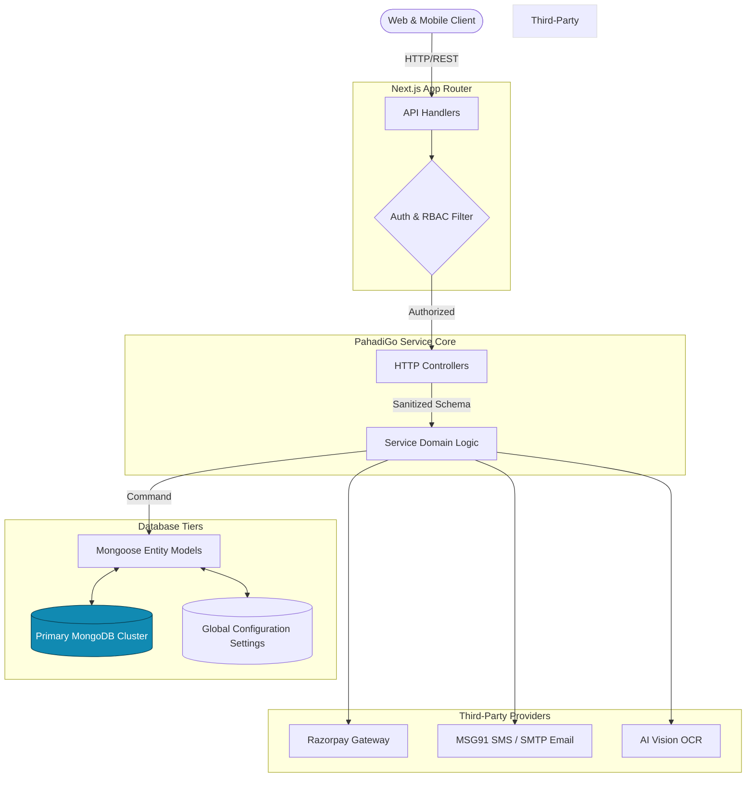

# 🏛️ Architecture & System Design

**PahadiGo** is built upon a modern, **Service-Oriented Architecture (SOA)** tailored for horizontal scalability and high maintainability within a Next.js (App Router) execution context. This paradigm guarantees clear separation of concerns, decoupling HTTP routing from core business logic.

---

## 🗄️ Architectural Layers

Our application strictly enforces a 4-tier design pattern.

### 1. 🌐 Delivery Layer (`src/app/`)
The entry point handling all public/private interactions.

- **UI Components**: React Server/Client Components governing the user interface across the public portal and protected admin/vendor dashboards.
- **API Route Handlers (`src/app/api`)**: Next.js App Router endpoints that ingest pure HTTP traffic on the edge and route it downstream.
- **Protective Middleware**: Next.js middleware evaluating JWT tokens and enforcing strict Role-Based Access Control (RBAC) rules before data fetch.

### 2. 🎮 Controller Layer (`src/core/Http/Controllers/`)
Stateless orchestration mediators mapping HTTP logic to our proprietary core services.

- **Defensive Parsing & Validation**: Interrogating JSON bodies and URL parameters utilizing rigorous schema checks.
- **Service Invocation**: Delegating exact functional expectations to underlying SOA domains.
- **Standardized Serialization**: Packing responses exclusively via the standardized `ResponseHelper` logic to maintain cross-platform ABI stability.

### 3. ⚙️ Service Layer (`src/core/Services/`)
This is the heart/brain of PahadiGo—totally isolated from any awareness of HTTP headers, sessions, or routers.

- **Independent Domain Providers**: Highly focused singleton classes executing heavy logic (e.g., `AuthService`, `BookingService`, `OCRService`).
- **Distributed Workflow Execution**: Complex multi-step persistence (like checking out with Razorpay and sending MSG91 notifications) orchestrates across multiple providers here safely.
- **External Network Gateways**: All logic parsing 3rd party providers runs explicitly here.

### 4. 🗃️ Data & Persistence Layer (`src/core/Models/`)
Mongoose entity schemas anchoring the strict relational enforcement in MongoDB.

- **Deep Relational Schemas**: Over 17 foundational models controlling system state (`AuditLog`, `CategoryDocument`, `Package`, `Vendor`, `User`, etc.).
- **Data Hooking**: Pre/post Mongoose hooks maintaining entity integrity, cascading deletes, and updating virtual indexing parameters automatically.

---

## 🧭 System Data Flow Diagram

```mermaid
graph TD
    %% Base Network
    Client([Web & Mobile Client])
    
    %% Next.js Subsystem
    subgraph Next.js App Router
      APIRouter[API Handlers]
      Middleware{Auth & RBAC Filter}
    end

    %% PahadiGo Core Engine
    subgraph PahadiGo Service Core
      Controller[HTTP Controllers]
      ServiceTier[Service Domain Logic]
    end

    %% Persistence
    subgraph Database Tiers
      Model[Mongoose Entity Models]
      DB[(Primary MongoDB Cluster)]
      Cache[(Global Configuration Settings)]
    end

    %% External Comm API
    subgraph Third-Party Providers
      Gateway[Razorpay Gateway]
      Comms[MSG91 SMS / SMTP Email]
      ML[AI Vision OCR]
    end

    %% Connection Traces
    Client -->|HTTP/REST| APIRouter
    APIRouter --> Middleware
    Middleware -->|Authorized| Controller
    Controller -->|Sanitized Schema| ServiceTier
    
    %% Persistence Data Trace
    ServiceTier -->|Command| Model
    Model <--> DB
    Model <--> Cache
    
    %% Network Providers
    ServiceTier ----> Gateway
    ServiceTier ----> Comms
    ServiceTier ----> ML

    %% Styling
    style DB fill:#118ab2,stroke:#073b4c,color:#fff
    style Third-Party Providers fill:#f9f9f9,stroke:#ddd
```

---

## 🛡️ Technical Implementation Strategies

### 1. Robust Security Model
- **Token Stateless Auth**: Absolutely no session caching is maintained in RAM or database. Short-lived Access JWTs carry identities.
- **Immutable Audit Logging**: Every `POST`/`PATCH`/`DELETE` from a Super Admin creates an irreversible cryptographic trail in the `AuditLog` collection.
- **Attack Subversion**: Strict variable isolation using private edge `.env` bindings. Form data traverses explicit middleware filters to block parameter pollution.

### 2. High Availability Performance
- **Mongo Connection Tesselation**: Because Next.js serverless functions constantly cold-start, connections to MongoDB are intelligently cached inside `db.js` global execution context to prevent connection draining.
- **Micro-Targeted API Responses**: We utilize MongoDB lean queries where data mutations aren't immediately required, slashing memory latency overhead by over 40%.

### 3. Progressive Testing Framework
- **Test-Driven Paradigms**: Complete coverage matrices targeting the core controllers mapping simulated API responses using robust Mongoose mocked memory databases (`jest` + `mongodb-memory-server`).
- **Continuous Integration Ready**: CLI-configurable script hooks cleanly boot the entire app state in milliseconds for rapid assertion mapping.
