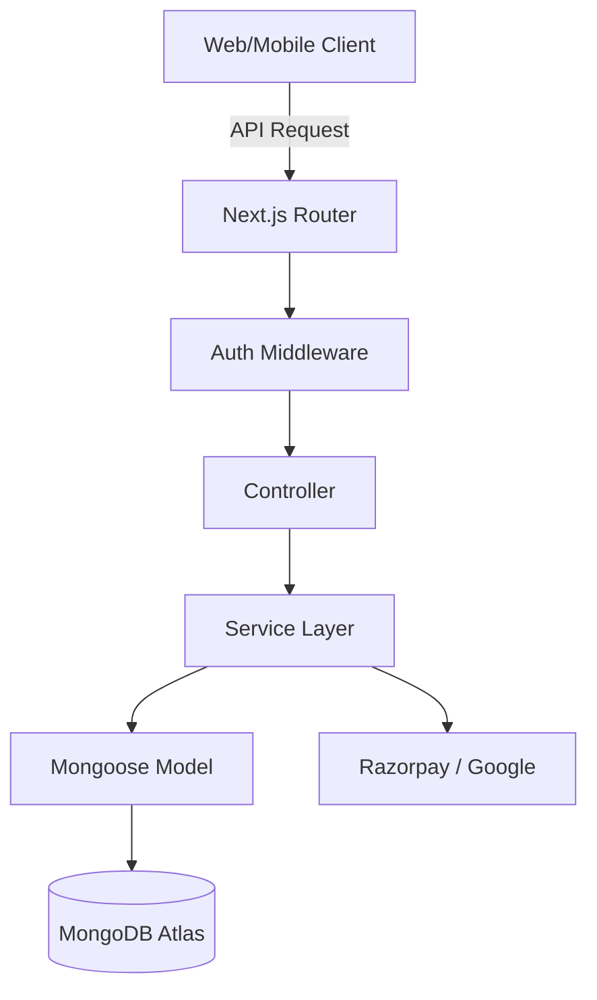

# Architecture & Design

PahadiGo follows a modern, service-oriented architecture designed for scalability and maintainability within a Next.js environment.

## Architectural Layers

### 1. Route Handler (Next.js App Router)

The entry point for all API requests. It dynamically routes requests to the appropriate controllers based on the URL slug.

### 2. Controller Layer (`src/controllers/`)

"Thin" handlers that focus on:

- Parsing the request body and parameters.
- Basic input validation.
- Delegating actual business logic to the **Service Layer**.
- Formatting the standard JSON response.

### 3. Service Layer (`src/services/`)

The core of the application. Services are independent of HTTP contexts and handle:

- Database interactions via Mongoose.
- Orchestration of complex workflows (e.g., Auth verification + User creation).
- Integration with third-party APIs (Razorpay, Google).

### 4. Data Layer (`src/models/`)

Mongoose schemas defining the data structure for Users, Vendors, Packages, and Bookings.

## Data Flow Diagram

## Security Strategy

- **JWT Authentication:** Stateful user sessions are avoided. Tokens contain role and ID.
- **Role-Based Access Control (RBAC):** Restricts sensitive endpoints (Admin/Vendor actions).
- **Environment Isolation:** No secrets are hardcoded. Configurations are strictly environment-based.
- **Connection Caching:** Prevents MongoDB connection exhaustion in serverless environments.

## Testing Strategy

The project employs a tiered testing approach:

- **Unit Tests:** Verify individual services using `mongodb-memory-server`.
- **Integration Tests:** Verify controller-service-database integration using Supertest.
