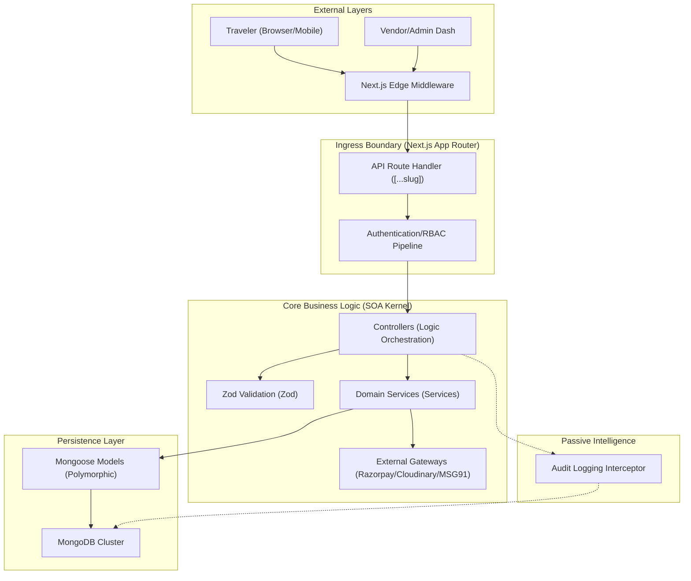

# 🏗️ System Architecture & Data Orchestration (Private Project)

**Owner & Lead Architect:** Er. Mradul Sharma

---

## 🏔️ 1. Domain Philosophical Core

**PahadiGo** is engineered as a **Service-Oriented Architecture (SOA)** encapsulated within the **Next.js 16 App Router** ecosystem. The architecture strictly enforces a unidirectional dependency graph:

`Ingress (API/UI) → Controllers → Services → Models → Persistence (MongoDB)`

### Abstracted Kernel Design

Unlike standard Next.js applications, PahadiGo decouples the **Next.js App Ingress** from the **Business Logic Kernel**. All heavy mutations, third-party integrations (Razorpay, MSG91), and complex validation routines reside in the `src/core` directory, which is agnostic of the specific HTTP presentation layer.

---

## 🚀 2. System Orchestration Diagram

---

## 🚦 3. Request & Information Lifecycle

Every packet traversing the PahadiGo environment follows a rigid, audited lifecycle to ensure transactional integrity.

### A. Presentation Layer (Ingress)

- **Public Website (`/(website)`)**: Uses React Server Components (RSC) with aggressive ISR (Incremental Static Regeneration) for lightning-fast catalog browsing.
- **Admin Dashboard (`/admin`)**: A high-security, client-driven React environment for real-time telemetry and management.
- **API Boundary (`/api`)**: Acts as a lightweight proxy, extracting payloads and handing them off to the `src/core/Http/Controllers`.

### B. Controller Layer

Controllers are responsible for logic orchestration and response serialization. They invoke the service layer but never perform direct database mutations.

### C. Service Layer (The Engine)

Services handle the "Grand Orchestration". They interact with domain models and third-party gateways:
- **AuthService**: Manages JWT generation, session boundaries, and social OAuth logic.
- **PaymentService**: Handles Razorpay order creation and asymmetric webhook verification.
- **PackageService**: Navigates the complex polymorphic package structures.

---

## 📊 4. Data Modeling & Polymorphism

PahadiGo utilizes **Mongoose Discriminators** to manage the heterogeneous nature of Himalayan travel products.

### Polymorphic Package Graph

The `Package` model acts as a base class, with specialized schemas for Trekking, Homestays, Rafting, and Vehicle Rentals. For a deep dive into the data structure, refer to [DATABASE_SCHEMA.md](DATABASE_SCHEMA.md).

### Persistence Strategy

- **Indexing**: All high-traffic paths utilize compound indexes to maintain O(1) or O(log N) lookup speeds.
- **Audit Logging**: Destructive actions are intercepted and stored in the `AuditLog` collection, providing a non-nullable history of administrative changes.

---

## 🛡️ 5. Security Infrastructure

- **Middleware Guarding**: Edge-compatible middleware evaluates JWT signatures at the routing boundary.
- **OCR Pipeline**: Utilizing `Tesseract.js` on the server-side for automated KYC.
- **Environment Isolation**: A cached configuration system (`getAppConfig`) ensures that secrets are never leaked into the client bundle.

---

## 🧪 6. Technical Quality Control

- **Headless Testing**: Every Controller and Service is evaluated against a mock MongoDB instance (`mongodb-memory-server`) using **Jest**.
- **Static Analysis**: ESLint 9.x maintains a strict recursive analysis of the `src/core` kernel.
